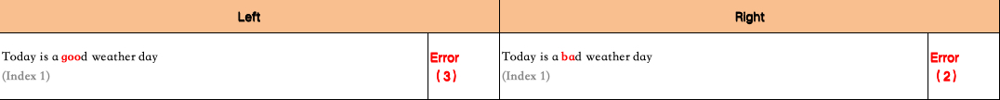
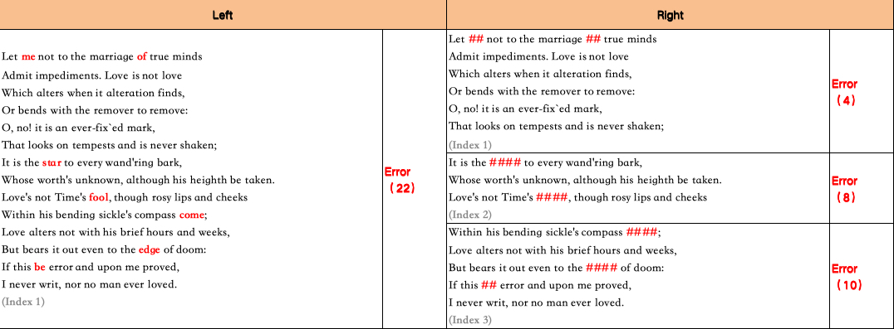

# texts-comparator
<p align="center">
  
</p>

<p align="center">
    【English | <a href="doc/README-Chinese.md">Chinese</a> | <a href="doc/README-Japanese.md">Japanese</a>】
</p>

## 📖 Overview
This tool is used for text comparison. It allows you to quickly identify the differences between two sets of similar texts, helping you to complete your tasks easily and efficiently.

---

### Example 1

#### Input

| Text A | Text B |
| --- | --- |
| Today is a good weather day | Today is a bad weather day |

#### Output

Output as `Excel`:

<p align="center">
  
</p>

Output as `JSON`:
```json
{
    "0": {
        "left": {
            "text": "Today is a good weather day",
            "red_marks": [11, 12, 13],
            "tag": "Index 1"
        },
        "right": [
            {
                "text": "Today is a bad weather day",
                "red_marks": [11, 12],
                "tag": "Index 1"
            }
        ]
    }
}
```

---

### Example 2

#### Input

<table>
  <tr>
    <th>Text A</th>
    <th>Text B</th>
  </tr>
  <tr>
    <td rowspan="3">Let me not to the marriage of true minds<br>Admit impediments. Love is not love<br>Which alters when it alteration finds,<br>Or bends with the remover to remove:<br>O, no! it is an ever-fix`ed mark,<br>That looks on tempests and is never shaken;<br>It is the star to every wand'ring bark,<br>Whose worth's unknown, although his heighth be taken.<br>Love's not Time's fool, though rosy lips and cheeks<br>Within his bending sickle's compass come;<br>Love alters not with his brief hours and weeks,<br>But bears it out even to the edge of doom:<br>If this be error and upon me proved,<br>I never writ, nor no man ever loved.</td>
    <td>Let ## not to the marriage ## true minds<br>Admit impediments. Love is not love<br>Which alters when it alteration finds,<br>Or bends with the remover to remove:<br>O, no! it is an ever-fix`ed mark,<br>That looks on tempests and is never shaken;</td>
  </tr>
  <tr>
    <td>It is the #### to every wand'ring bark,<br>Whose worth's unknown, although his heighth be taken.<br>Love's not Time's ####, though rosy lips and cheeks</td>
  </tr>
  <tr>
    <td>Within his bending sickle's compass ####;<br>Love alters not with his brief hours and weeks,<br>But bears it out even to the #### of doom:<br>If this ## error and upon me proved,<br>I never writ, nor no man ever loved.</td>
  </tr>
</table>

#### Output

Output as `Excel`:

<p align="center">
  
</p>

Output as `JSON`:
```json
{
    "0": {
        "left": {
            "text": "Let me not to the marriage of true minds\nAdmit impediments. Love is not love\nWhich alters when it alteration finds,\nOr bends with the remover to remove:\nO, no! it is an ever-fix`ed mark,\nThat looks on tempests and is never shaken;\nIt is the star to every wand'ring bark,\nWhose worth's unknown, although his heighth be taken.\nLove's not Time's fool, though rosy lips and cheeks\nWithin his bending sickle's compass come;\nLove alters not with his brief hours and weeks,\nBut bears it out even to the edge of doom:\nIf this be error and upon me proved,\nI never writ, nor no man ever loved.",
            "red_marks": [4, 5, 27, 28, 241, 242, 243, 244, 343, 344, 345, 346, 413, 414, 415, 416, 496, 497, 498, 499, 518, 519],
            "tag": "Index 1"
        },
        "right": [
            {
                "text": "Let ## not to the marriage ## true minds\nAdmit impediments. Love is not love\nWhich alters when it alteration finds,\nOr bends with the remover to remove:\nO, no! it is an ever-fix`ed mark,\nThat looks on tempests and is never shaken;", 
                "red_marks": [4, 5, 27, 28], 
                "tag": "Index 1"
            },
            {
                "text": "It is the #### to every wand'ring bark,\nWhose worth's unknown, although his heighth be taken.\nLove's not Time's ####, though rosy lips and cheeks", 
                "red_marks": [10, 11, 12, 13, 112, 113, 114, 115], 
                "tag": "Index 2"
            },
            {
                "text": "Within his bending sickle's compass ####;\nLove alters not with his brief hours and weeks,\nBut bears it out even to the #### of doom:\nIf this ## error and upon me proved,\nI never writ, nor no man ever loved.", 
                "red_marks": [36, 37, 38, 39, 119, 120, 121, 122, 141, 142], 
                "tag": "Index 3"
            }
        ]
    }
}
```

---

## 👨‍💻‍ Contributors

<a href="https://github.com/VintLin/texts-comparator/contributors">
  
</a>

Made with [contrib.rocks](https://contrib.rocks).

## ⚖️ License

- Source Code Licensing: Our project's source code is licensed under the MIT License. This license permits the use, modification, and distribution of the code, subject to certain conditions outlined in the MIT License.
- Project Open-Source Status: The project is indeed open-source; however, this designation is primarily intended for non-commercial purposes. While we encourage collaboration and contributions from the community for research and non-commercial applications, it is important to note that any utilization of the project's components for commercial purposes necessitates separate licensing agreements.

## 🌟 Star History

[](https://star-history.com/#VintLin/texts-comparator&Date)

## 📬 Contact

If you have any questions, feedback, or would like to get in touch, please feel free to reach out to us via email at [vintonlin@gmail.com](mailto:vintonlin@gmail.com)
