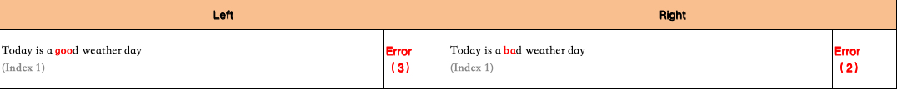

# Texts 对比工具
<p align="center">
  
</p>

<p align="center">
    【<a href="../doc/README-English.md">英语</a> | 中文 | <a href="../doc/README-Japanese.md">日语</a>】
</p>

## 📖 概览
此工具用于文本比较。它能快速识别两组相似文本之间的差异，帮助您轻松高效地完成文本比对任务。

---

### 样例 1

#### 输入

| 文本 A | 文本 B |
| --- | --- |
| Today is a good weather day | Today is a bad weather day |

#### 输出

以 `Excel` 输出：

<p align="center">
  
</p>

以 `JSON` 输出：
```json
{
    "0": {
        "left": {
            "text": "Today is a good weather day",
            "red_marks": [11, 12, 13],
            "tag": "Index 1"
        },
        "right": [
            {
                "text": "Today is a bad weather day",
                "red_marks": [11, 12],
                "tag": "Index 1"
            }
        ]
    }
}
```

---

### 样例 2

#### 输入

<table>
  <tr>
    <th>文本 A</th>
    <th>文本 B</th>
  </tr>
  <tr>
    <td rowspan="3">Let me not to the marriage of true minds<br>Admit impediments. Love is not love<br>Which alters when it alteration finds,<br>Or bends with the remover to remove:<br>O, no! it is an ever-fix`ed mark,<br>That looks on tempests and is never shaken;<br>It is the star to every wand'ring bark,<br>Whose worth's unknown, although his heighth be taken.<br>Love's not Time's fool, though rosy lips and cheeks<br>Within his bending sickle's compass come;<br>Love alters not with his brief hours and weeks,<br>But bears it out even to the edge of doom:<br>If this be error and upon me proved,<br>I never writ, nor no man ever loved.</td>
    <td>Let ## not to the marriage ## true minds<br>Admit impediments. Love is not love<br>Which alters when it alteration finds,<br>Or bends with the remover to remove:<br>O, no! it is an ever-fix`ed mark,<br>That looks on tempests and is never shaken;</td>
  </tr>
  <tr>
    <td>It is the #### to every wand'ring bark,<br>Whose worth's unknown, although his heighth be taken.<br>Love's not Time's ####, though rosy lips and cheeks</td>
  </tr>
  <tr>
    <td>Within his bending sickle's compass ####;<br>Love alters not with his brief hours and weeks,<br>But bears it out even to the #### of doom:<br>If this ## error and upon me proved,<br>I never writ, nor no man ever loved.</td>
  </tr>
</table>

#### 输出

以 `Excel` 输出：

<p align="center">
  
</p>

以 `JSON` 输出：
```json
{
    "0": {
        "left": {
            "text": "Let me not to the marriage of true minds\nAdmit impediments. Love is not love\nWhich alters when it alteration finds,\nOr bends with the remover to remove:\nO, no! it is an ever-fix`ed mark,\nThat looks on tempests and is never shaken;\nIt is the star to every wand'ring bark,\nWhose worth's unknown, although his heighth be taken.\nLove's not Time's fool, though rosy lips and cheeks\nWithin his bending sickle's compass come;\nLove alters not with his brief hours and weeks,\nBut bears it out even to the edge of doom:\nIf this be error and upon me proved,\nI never writ, nor no man ever loved.",
            "red_marks": [4, 5, 27, 28, 241, 242, 243, 244, 343, 344, 345, 346, 413, 414, 415, 416, 496, 497, 498, 499, 518, 519],
            "tag": "Index 1"
        },
        "right": [
            {
                "text": "Let ## not to the marriage ## true minds\nAdmit impediments. Love is not love\nWhich alters when it alteration finds,\nOr bends with the remover to remove:\nO, no! it is an ever-fix`ed mark,\nThat looks on tempests and is never shaken;", 
                "red_marks": [4, 5, 27, 28], 
                "tag": "Index 1"
            },
            {
                "text": "It is the #### to every wand'ring bark,\nWhose worth's unknown, although his heighth be taken.\nLove's not Time's ####, though rosy lips and cheeks", 
                "red_marks": [10, 11, 12, 13, 112, 113, 114, 115], 
                "tag": "Index 2"
            },
            {
                "text": "Within his bending sickle's compass ####;\nLove alters not with his brief hours and weeks,\nBut bears it out even to the #### of doom:\nIf this ## error and upon me proved,\nI never writ, nor no man ever loved.", 
                "red_marks": [36, 37, 38, 39, 119, 120, 121, 122, 141, 142], 
                "tag": "Index 3"
            }
        ]
    }
}
```

---

## 👨‍💻‍ 贡献者

<a href="https://github.com/VintLin/texts-comparator/contributors">
  
</a>

使用[contrib.rocks](https://contrib.rocks)制作。

## ⚖️ 许可证

- 源代码许可证：我们的项目源代码根据MIT许可证授权。该许可证允许使用、修改和分发代码，但受到MIT许可证中概述的某些条件的限制。
- 项目开源状态：该项目确实是开源的，但主要用于非商业目的。虽然我们鼓励社区合作和贡献，用于商业目的的项目组件的任何使用都需要单独的许可协议。

## 🌟 星标历史

[](https://star-history.com/#VintLin/texts-comparator&Date)

## 📬 联系

如果您有任何问题、反馈或想与我们联系，请随时通过电子邮件[vintonlin@gmail.com](mailto:vintonlin@gmail.com)与我们联系。
